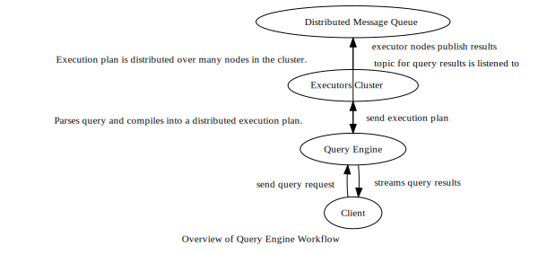

Background and Problem Description
==================================

Company Overview
----------------

-   Major global investment bank, with offices all over the world

-   Provides many different financial services including: private and commercial banking, asset management, investment banking, and brokerage

-   Large number of employees dedicated to developing the tech infrastructure that powers all their services

-   Was working at one of their tech focused offices

What my team worked on
----------------------

-   Developed our own structured querying language

    -   **Abstract**, not specific to a storage or processing technology

    -   **Easy to learn**, simple SQL-like syntax

-   Developed corresponding **Query Engine** service

    -   Web service that listens for query requests from clients

    -   Compiles the abstract query into an execution plan specific to underlying storage of referenced datasets

    -   Plan executed on large distributed computing cluster

    -   Query engine forwards the stream of query results back to the client

Motivation for developing the system
------------------------------------

### \#1: one query, multiple storage technologies

-   When the querying language is specific to one storage technology, then need to rewrite all queries when migrating to a different storage technology

-   Our querying language designed to be agnostic to storage technology

-   The query engine translates the abstract query into a specific execution plan

-   Main benefit: not tied down to a specific storage solution because of high migration cost

### \#2: make distributed processing easy for our end users

-   Data the company needs to process is **huge**!

-   Excel doesn’t cut it and SQL doesn’t scale well to distributed data

-   But programming using a distributed processing framework like MapReduce introduces high barrier of entry

    -   Need experts to code your queries!

-   **Solution**: write simple queries with our language and our query engine will turn it into a distributed program for you!

What is the problem?
--------------------

-   So far only Hadoop Distributed File System (HDFS) supported

    -   Therefore all datasets referenced in query must be stored in HDFS

-   HDFS is good distributed storage for some use cases, but not others

-   Workaround for using our query engine on data in other databases:

    -   First, rewrite the data in other databases as datasets stored in HDFS

    -   Then query the data as normal

    -   Super time and space inefficient in practice!

Introducing Cassandra
---------------------

-   Distributed database, suitable for a lot of use cases where HDFS falls short

|                              | HDFS                                                                  | Cassandra                              |
|------------------------------|-----------------------------------------------------------------------|----------------------------------------|
| data record size             | good for storing huge files, bad for lots of small files              | good for writing many small records    |
| writing frequency/throughput | good for writing in large batches, not good for super frequent writes | can handle millions of writes a second |

-   So Cassandra can complement HDFS very well in the cases where it is more suitable!

A major problem with Cassandra
------------------------------

-   Each record has a unique key on which it is also sorted on and optionally some clustering keys

-   Can’t create arbitrary efficient indexes like a relational database

-   Consequence: queries using Cassandra’s native CQL are only efficient when selecting by specific keys, range of keys, or clustering keys

-   All other queries including virtually all aggregating operations are super inefficient!

-   Can get around this by processing Cassandra data through Spark, a distributed processing framework

    -   Aggregates become very efficient again!

    -   But requires experts again to write the Spark programs

Idea: kill two birds with one stone
-----------------------------------

-   Have our query engine be able to compile the abstract queries into execution plans over data stored in Cassandra

-   Users can use Cassandra for their use cases and be able to use our powerful platform for querying

    -   Without having to first rewrite the data to HDFS, saving time and storage for the company

-   Query Engine already uses Spark as its distributed processing framework for creating execution plans

    -   Can provide efficient aggregate results for data in Cassandra

    -   Wile abstracting the complexity of Spark and providing a simple querying language interface for the users

Next: [Objectives](objectives) | [back to index](index)
