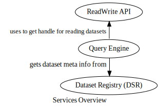

Objectives
==========

The end goal of this project is to solve the problems described, by extending the Query Engine to support compiling queries into execution plans over data stored in Cassandra. Further, the Query Engine will need to access the Cassandra data, instead of first rewriting the data into HDFS for compatibility reasons, so that executing such queries doesn’t lead to the same space and time inefficiencies associated with this workaround. Finally, the processing of Cassandra data needs to be defined using Spark, so that aggregates and other query operations not efficient in CQL are performant.

Overview of relevant components
-------------------------------

Changes will need to be made to three different services to achieve the stated objectives.

-   **Dataset Registry (DSR)**, global registry of meta data (URI, schema, etc.) for datasets

    -   Needs to be extended to support registering Cassandra datasets

-   **ReadWrite API**, service used by multiple applications (includingQuery Engine and executor clusters) for reading/writing to/from different databases at the company

    -   When given a Cassandra dataset URI, needs to be able to provide access to reading it

-   Query Engine, processes query requests, getting the required datasets through ReadWrite API, formatting the data into Spark Dataframes using schema from DSR, and creating and executing a Spark plan to produce the results

    -   Extended to support performing queries over data stored in company’s Cassandra databases

    -   Needs to format Cassandra dataset into Spark Dataframes

    -   Translate query language features into efficient Spark program over the Dataframes

Deliverables
------------

-   Source code branches with implemented changes for Query Engine, DSR, and ReadWrite API

-   suite of automated unit and integration tests demonstrating the correctness of the changes

-   documentation of the code changes, aimed at developers that will move the project forward after handoff

Next: [Work Plan](work_plan) | [back to index](index)
