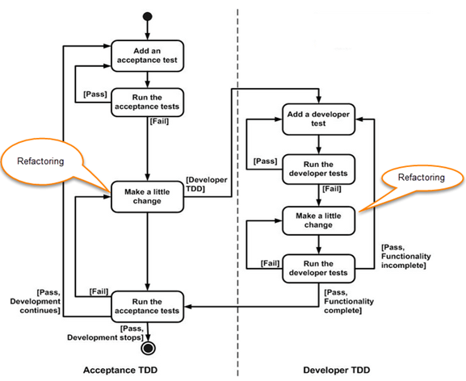

Work Plan
=========

This page describes the strategies and planned activities for fulfilling the stated objectives of the project.

Strategies
----------

### Test Driven Development

-   One major deliverable for the project is extensive test suite demonstrating correctness of changes

-   This project will use TDD style

-   Test driven development (TDD) is commonly used paradigm for faster development with fewer bugs

-   Write tests first!

    -   Only write enough code to make the tests pass

    -   If need to implement more features, write the tests first and again only develop enough code to make them pass

-   Major advantages:

    -   Good test coverage from the start

    -   Get fast, automated feedback on the correctness of the code at any time

    -   Since need to write tests before code, keeps test coverage high as code grows

[Source and more info](https://www.guru99.com/test-driven-development.html)

### Service Mocking

-   Implementing features that need to touch multiple separate components or services

-   Making changes to all components at the same time is very unwieldy

-   Ideally would just focus on one component at a time

-   Mocking to the rescue

    -   Instead of using a service directly, pretend to use it, while using a simpler local version

    -   Example, instead of using a database, use a local file

    -   Key: both the real service and the mock service must provide the same interface, so they can be simply switched out

-   Workplan will consist of three stages

1.  DSR and ReadWrite API are mocked, Query Engine 1. changes are implemented

2.  Implement DSR changes

3.  Implement ReadWrite API changes

Activities 
-----------

### 1 Develop Query Engine changes

-   Running Query Engine in “local mode”, where external services are mocked

    -   DSR replaced with hard coded entries in local file

    -   ReadWrite API replaced with accessing a Cassandra instance running locally

    1.  #### Automated tests for local engine

-   Suite of unit tests checking queries are executed correctly

-   Simplest just checking can perform scan of a dataset

-   More complex tests exercising query language features, namely filtering, aggregating, and joining

-   Verified to work by using local HDFS with test data and existing Query Engine implementation as reference

#### 1.2 Engine can transform Cassandra data into Spark Dataframes

-   basis of constructing a Spark execution plan is formatting the data into Spark Dataframes

-   develop necessary changes and verify with test suite

    1.  #### Querying language features translate to Spark programs

-   With the basis of constructing Spark programs over the Cassandra data completed, work on translating language features to Spark programs

-   Filtering, ordering, aggregating, joining

-   Verified to work with test suite

### 2 Create integration test suite

-   With Query Engine changes complete, need to transition to testing services in deployment instead of locally with mocks

-   Deploy Query Engine in dev environment, instead of running locally, but still use mocks since they aren’t implemented

-   As changes in services implemented, switch out the mocks one by one

-   Recreate suite of unit tests as standalone program to run in dev environment, to test integration between components

### 2 Implement changes for DSR

-   DSR needs to be able to provide the URI and Schema for the Cassandra dataset, which Query Engine will use to create execution plan

-   Use knowledge gained from figuring out how to format Cassandra dataset as Spark dataframe

-   Make possible to register a Cassandra dataset with relevant meta data (URI and schema)

-   Verify changes are correct with integration test suite

### 4 Implement changes for ReadWrite API

-   When providing the URI to a Cassandra dataset, the ReadWrite API needs to return back a handle for reading the dataset on top of which the execution plan is built

-   For testing this, will switch to an remote Cassandra instance in the company’s dev cloud

-   Verify to work using integration test suite

### 5 Finish documentation and handoff

-   After code changes complete and verified with testing to work

-   Finish documentation intended for engineers that will work on the system after handoff

-   Finally provide all the deliverables to the company

Next: [Reflection](reflection) | [back to index](index)
